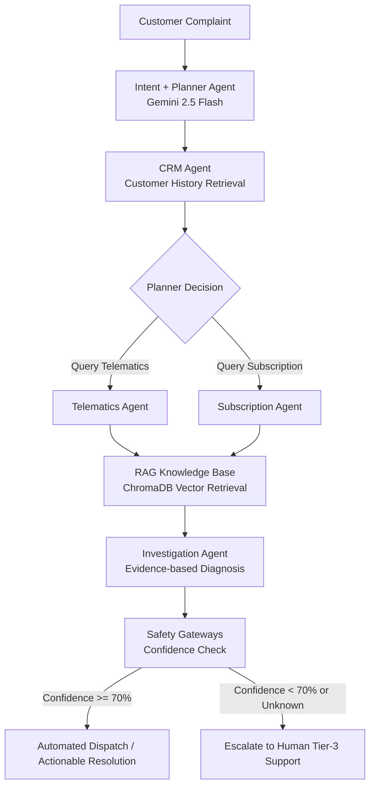

# Project Synopsis: Connected Car AI Support Console

**Project Title:** Connected Car AI Support Console  
**Domain:** Artificial Intelligence, Multi-Agent Systems, Natural Language Processing, Retrieval-Augmented Generation (RAG), Automotive IoT  
**Deployment Platform:** Hugging Face Spaces (Dockerized)  
**AI Orchestrator Engine:** LangGraph (StateGraph Workflow)  
**Primary Language & Model:** Python 3.11/3.12, Google Gemini 2.5 Flash  

---

## 1. Project Overview & Abstract

Modern passenger vehicles are equipped with telematics control units (TCUs) and mobile app companions (e.g., Tesla App, MyBMW, FordPass) that coordinate with cloud servers, billing systems, and hardware ECUs. When a customer reports a connectivity or remote operation failure (e.g., remote-start failure, pairing disconnects, or navigation routing drops), support engineers must manually trace logs across multiple isolated databases:
1. **Customer Relationship Management (CRM)** databases to identify owner details and VIN histories.
2. **Telematics Databases** to check signal strengths (RSSI), cellular network status, and battery State of Charge (SoC).
3. **Billing & Subscription Databases** to check active entitlements for remote packages.
4. **Mechanical & Technical Manuals** to cross-reference diagnostic trouble codes (DTCs) and troubleshooting steps.

The **Connected Car AI Support Console** is an automated, stateful, multi-agent diagnostic platform that uses a Directed Acyclic Graph (DAG) state-machine to automate this investigation. Powered by **LangGraph** and **Google Gemini 2.5 Flash**, the system classifies incoming customer complaints, dynamically executes data-retrieval routes, retrieves troubleshooting advice using a **Retrieval-Augmented Generation (RAG)** pipeline powered by **ChromaDB**, isolates the root cause with evidence, and generates step-by-step remediation plans. The entire platform is fronted by a dark-themed glassmorphic **Streamlit** dashboard and deployed inside a secure **Docker container** on **Hugging Face Spaces**.

---

## 2. Problem Statement & Motivation

As vehicles become software-defined IoT platforms, the volume of software-related support inquiries has scaled exponentially. Debugging these issues presents several friction points:
* **Siloed Diagnostics**: Customer records, subscription status, and live vehicle pings reside in separate databases. Support agents waste critical time context-switching between tools.
* **Complex Dependencies**: A single symptom (e.g., "Cannot lock doors via app") could be caused by an expired subscription, a dead key fob battery, a sleeping cellular TCU, or a faulty lock actuator.
* **Variable Technical Literacy**: Human support representatives require immediate access to updated mechanical manuals and service bulletins.
* **High Operational Costs**: Complex issues are escalated prematurely to expensive Tier-3 field engineers, delaying resolution.

By orchestrating specialized agents that execute database retrievals conditionally, this system reduces Case Resolution Time (CRT) from hours to seconds, providing clear evidence-backed diagnoses and automated mitigation protocols.

---

## 3. Workflow Architecture & Agentic DAG

The project uses **LangGraph's stateful orchestration** to route data sequentially and conditionally across different nodes. The workflow is represented below:

### 3.1 Architecture Execution Flow
```text
                  ┌─────────────────────────────┐
                  │      Customer Complaint     │
                  └──────────────┬──────────────┘
                                 │
                                 ▼
                  ┌─────────────────────────────┐
                  │   Intent & Planner Agent    │
                  │   - Classifies query domain │
                  │   - Mapped severity levels  │
                  └──────────────┬──────────────┘
                                 │
                                 ▼
                  ┌─────────────────────────────┐
                  │          CRM Agent          │
                  │   - Extracts Customer Details│
                  │   - Resolves VIN Mapping    │
                  └──────────────┬──────────────┘
                                 │
                                 ▼
                  ┌─────────────────────────────┐
                  │      Telematics Agent       │
                  │   - Checks ECU connection   │
                  │   - Gathers Battery/RSSI    │
                  └──────────────┬──────────────┘
                                 │
                                 ▼
                  ┌─────────────────────────────┐
                  │     Subscription Agent      │
                  │   - Validates Entitlements  │
                  │   - Identifies Expirations  │
                  └──────────────┬──────────────┘
                                 │
                                 ▼
                  ┌─────────────────────────────┐
                  │     Knowledge Base RAG      │
                  │   - Semantic Search of KB   │
                  │   - Fetches PDF/Text Manuals│
                  └──────────────┬──────────────┘
                                 │
                                 ▼
                  ┌─────────────────────────────┐
                  │     Investigation Agent     │
                  │   - Isolates Root Cause     │
                  │   - Formulates Resolution   │
                  │   - Determines Confidence   │
                  └──────────────┬──────────────┘
                                 │
                                 ▼
                  ┌─────────────────────────────┐
                  │    Decision Gateway/Safety  │
                  │   - High Confidence: Output  │
                  │   - Low Confidence: Escalate│
                  └─────────────────────────────┘
```

### 3.2 Mermaid.js Workflow DAG


---

## 4. Shared State Schema (`AgentState`)

To maintain session context across all agents, the system shares a common mutable state declared in `graph/state.py` using Python's `TypedDict` notation:

```python
from typing_extensions import TypedDict

class AgentState(TypedDict):
    customer_query: str          # Raw input description from customer
    planner_decision: dict       # Dynamic flags set by Planner: {"crm": bool, "telematics": bool, "subscription": bool}
    issue_category: str          # Mapped domain (e.g., app_pairing, vehicle_start_issue)
    severity: str                # Classified threat level (low, medium, high, critical)
    confidence: float            # LLM's classification confidence
    customer_id: str             # Customer account ID
    vehicle_id: str              # Vehicle VIN identifier
    crm_data: dict               # Customer records retrieved from CRM
    telematics_data: dict        # ECU signal, online status, battery SoC values
    subscription_status: str     # Billing package state (e.g., active, expired)
    kb_context: str              # Text context pulled from ChromaDB RAG
    root_cause: str              # Isolated root failure point
    resolution: str              # Actionable fix recommendations
    root_cause_confidence: float # Investigation confidence score
    evidence_used: list          # Specific data points used to verify root cause
    investigation_steps: list    # Step-by-step audit logs of execution
```

---

## 5. Agent Nodes & Functional Specifications

Each node in the LangGraph DAG operates as a specialized micro-service agent utilizing Google Gemini 2.5 Flash:

1. **Intent & Planner Node (`agents/intent_agent.py`)**:
   * Evaluates the raw complaint to identify the domain category (e.g., `app_pairing`, `door_lock_issue`, `subscription_issue`, `vehicle_start_issue`).
   * Decides which backend data layers require queries using defined planner rules (e.g., `door_lock_issue` bypasses subscription lookup, but `app_pairing` triggers CRM, telematics, and subscription queries).
2. **CRM Profile Node (`agents/crm_agent.py`)**:
   * Queries customer metrics (e.g., ticket count, mapped VIN) from `data/crm.json` using the customer ID.
3. **Telematics Node (`agents/telematics_agent.py`)**:
   * Activates only if `planner_decision["telematics"]` is `True`.
   * Checks the telemetry parameters (e.g., `online` state, `battery` percentage, and `network` strength) from `data/telematics.json`.
4. **Subscription Node (`agents/subscription_agent.py`)**:
   * Activates only if `planner_decision["subscription"]` is `True`.
   * Retrieves billing entitlements from `data/subscriptions.json` to verify package statuses (e.g., `active` or `expired`).
5. **Knowledge Base RAG Node (`agents/knowledge_agent.py`)**:
   * Uses semantic search queries via **ChromaDB** to retrieve context from vehicle troubleshooting manuals in `data/kb/`.
6. **Investigation Node (`agents/investigation_agent.py`)**:
   * Consolidates all collected inputs: CRM records, telematics parameters, subscription entitlements, and RAG guidelines.
   * Leverages Gemini 2.5 Flash's reasoning capability to isolate **one** definitive root cause, compile a step-by-step resolution list, assign an investigation confidence rating, and log the evidence utilized.

---

## 6. Databases & Data Schema

The platform implements simulated enterprise data stores to validate its reasoning capabilities:

### 6.1 CRM Registry (`data/crm.json`)
Maps customers to vehicles and logs customer ticket histories.
```json
{
  "C001": {
    "name": "Hemanth N",
    "vehicle_id": "V001",
    "previous_tickets": 3
  }
}
```

### 6.2 Telematics Registry (`data/telematics.json`)
Logs cellular connection status and battery parameters.
```json
{
  "V001": {
    "online": true,
    "battery": 78,
    "network": "good"
  }
}
```

### 6.3 Subscription Entitlements (`data/subscriptions.json`)
Logs activation status of remote service subscriptions.
```json
{
  "C001": {
    "status": "expired"
  },
  "C002": {
    "status": "active"
  }
}
```

### 6.4 RAG Knowledge Base (`data/kb/*.txt`)
Contains standard operating procedures (SOPs) for automotive issues. Examples include:
* `door_lock_issue.txt`: Details unlock diagnostics (fob batteries, actuator faults).
* `app_pairing.txt`: Details mobile app synchronization procedures.
* `subscription_issue.txt`: Details billing activation and provisioning delays.

---

## 7. Safety Gateways & Governance Guardrails

To prevent incorrect diagnostic actions or automated script executions, the system deploys two safety guardrails:
1. **Low Confidence Gateway**: If the Investigation Agent's isolated root cause confidence falls below **70%** (`root_cause_confidence < 0.70`), the system locks automated execution and routes the file to **Tier-3 Engineering support**.
2. **Unknown Scope Route**: If the Intent Classifier fails to parse the customer query and labels it as `unknown`, the system bypasses automatic troubleshooting and issues an immediate escalation ticket to human technicians.

---

## 8. Technology Stack

* **Stateful Orchestrator**: LangGraph StateGraph
* **LLM Engine**: LangChain Core / ChatGoogleGenerativeAI (Google Gemini 2.5 Flash)
* **Vector Store (RAG)**: ChromaDB (Semantic Embedding Lookup)
* **Frontend GUI Console**: Streamlit (Glassmorphism dark theme UI featuring customizable sidebars, custom layout, and responsive logs)
* **Configuration / Dev**: Python-Dotenv (Environment key configuration), Pydantic v2 (Data validation)
* **Containerization**: Docker (Python 3.11 base image)
* **Deployment & Hosting**: Hugging Face Spaces

---

## 9. Dockerization & Hugging Face Deployment

The project has been containerized and deployed to **Hugging Face Spaces** using Docker to guarantee cross-environment stability. 

### 9.1 Dockerfile Structure
```dockerfile
FROM python:3.11

WORKDIR /app

COPY . .

RUN pip install --no-cache-dir -r requirements.txt

EXPOSE 7860

CMD ["streamlit", "run", "app.py", "--server.port=7860", "--server.address=0.0.0.0"]
```

### 9.2 Hugging Face Configuration Highlights
* **Hosting Space Type**: Docker Space (Runs custom Streamlit images on CPU/GPU hardware).
* **Port Exposer**: Port `7860` is exposed to allow Hugging Face's reverse proxy to route public incoming traffic directly to the Streamlit engine.
* **Environment Configuration**: API keys (specifically `GOOGLE_API_KEY`) are managed securely inside Hugging Face Spaces' **Repository Secrets** dashboard to prevent credential leaks.

---

## 10. Key Features of the Console

* **Stateful Execution Logs**: Visual audit trails showcasing exactly which agents were activated, skipped, and what data they processed.
* **Interactive Diagnosis presets**: Sidebars preloaded with diagnostic complaints (e.g. door lock issues, app pairing errors, navigation system failures).
* **Dynamic Planning**: Avoids hitting unnecessary endpoints, saving LLM token overhead by only calling databases relevant to the classified category.
* **Evidence-Based Explanations**: Output displays the exact criteria (e.g., "TCU Offline", "Billing status: expired") that led to the final verdict.
