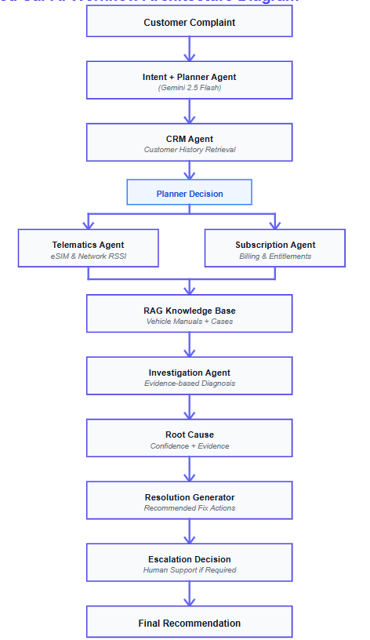

# Connected Car AI Support Agent

## Overview

Connected Car AI Support Agent is a multi-agent automotive troubleshooting platform built using LangGraph, Streamlit, Gemini/Ollama(LLM), CRM simulation, Telematics simulation, and Retrieval Augmented Generation (RAG).

The system automatically investigates customer complaints, gathers vehicle information, determines root causes, and generates resolutions.

---

## Features

* Intent Classification
* Planner Agent
* CRM Retrieval
* Telematics Retrieval
* Subscription Validation
* RAG Knowledge Base
* Root Cause Analysis
* Resolution Generation
* Escalation Decision
* Investigation Timeline
* Streamlit Dashboard

---

## Architecture

---

## Workflow

Customer Complaint

↓

Intent + Planner Agent

↓

CRM Agent

↓

Telematics Agent

↓

Subscription Agent

↓

Knowledge Base Retrieval (RAG)

↓

Investigation Agent

↓

Root Cause Analysis

↓

Resolution Generation

↓

Final Recommendation

---

## Technologies Used

* Python
* LangGraph
* LangChain
* Streamlit
* Gemini 2.5 Flash
* ChromaDB
* RAG

---

## Installation

git clone <repo>

cd RTD-Project

pip install -r requirements.txt

streamlit run app.py

---

## Sample Outputs

### App Pairing Issue

[Insert Screenshot]

### Door Lock Issue

![\[Insert Screenshot\]](<doc/Door Lock Issue.png>)

### Navigation Issue

[Insert Screenshot]

---

## Future Enhancements

* Real CRM Integration
* Real Vehicle Telematics
* PDF Report Generation
* LangSmith Monitoring
* Cloud Deployment
