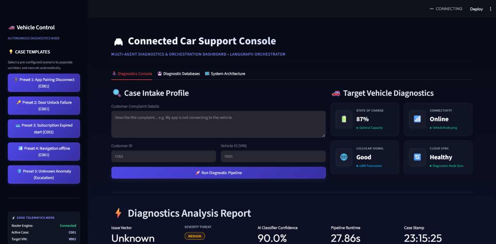
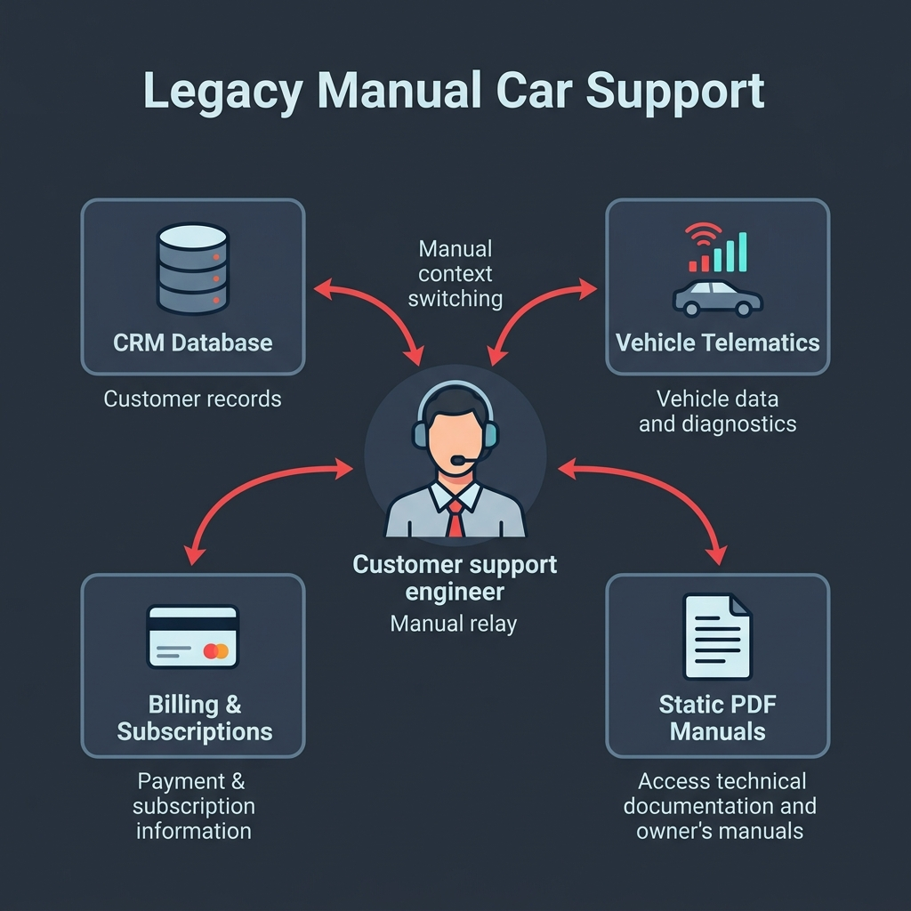
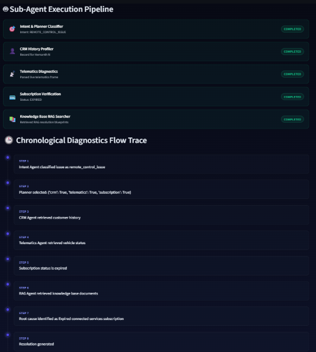
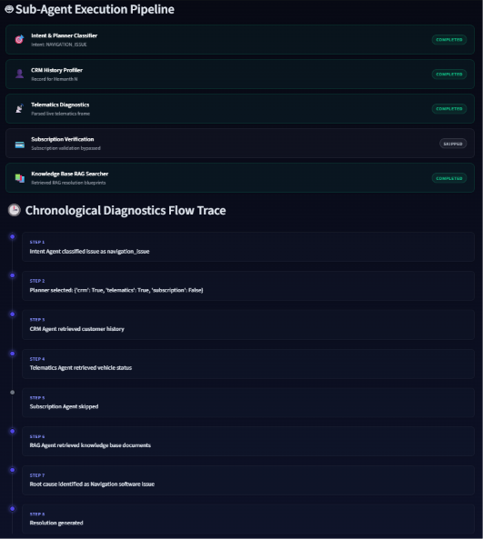
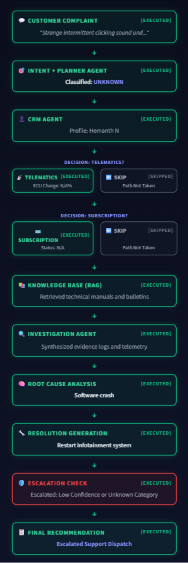

# 🚗 Connected Car AI Support Agent
### Autonomous Multi-Agent Diagnostic Platform for Software-Defined Vehicles (SDVs)

[](https://www.python.org/)
[](https://streamlit.io/)
[](https://github.com/langchain-ai/langgraph)
[](https://ai.google.dev/)
[](https://www.trychroma.com/)
[](https://huggingface.co/spaces)
[](#)

---

## 🎥 Demonstration Video

[](https://youtu.be/s5Km-zbYOw8)

> 📺 **Click above to watch the full project walkthrough on YouTube:** [https://youtu.be/s5Km-zbYOw8](https://youtu.be/s5Km-zbYOw8)  
> An offline HD screen recording is also archived in the repository under [`Demo Video/UI Demo.mp4`](Demo%20Video/UI%20Demo.mp4).

---

## 📌 Executive Overview

In the modern automotive industry, connected vehicles and Software-Defined Vehicles (SDVs) (e.g., Tesla, BMW ConnectedDrive, Hyundai Bluelink, FordPass) continuously synchronize mobile applications, cloud services, and in-vehicle electronic control units (ECUs). When a remote command fails—such as an app pairing failure, remote door unlock stall, navigation outage, or vehicle remote start rejection—support engineers must manually correlate disparate data silos:
1. **Customer CRM Records** (Ownership history, open tickets, VIN association)
2. **eSIM & TCU Telematics** (Cellular RSSI signal power, battery State of Charge [SoC], hardware locks)
3. **Subscription Entitlements** (Active remote package status, billing expirations)
4. **Knowledge Base Service Bulletins** (OEM repair manuals, DTC trouble codes, symptom trees)

The **Connected Car AI Support Agent** is a stateful, autonomous multi-agent diagnostic platform built on **LangGraph**, **Google Gemini 2.5 Flash**, and **ChromaDB**. It dynamically analyzes complaints, prunes unnecessary database queries by up to 66%, isolates root causes with evidence-backed confidence scoring, generates step-by-step remediation protocols, and integrates an **ISO 26262 compliant Technician-in-the-Loop (TITL)** safety governance workbench for authorized Over-The-Air (OTA) actuation.

---

## 🖥️ System User Interface

The platform features a modern, glassmorphic dark-themed diagnostic console built in Streamlit:



---

## 🏛️ System Architecture

The system operates on a **5-Pillar Architecture** that unifies natural language complaints, agentic graph orchestration, external IoT/DB layers, semantic RAG retrieval, and certified technician governance:


### Customer Support Workflow Flowchart (DAG)

The execution graph is structured as a Directed Acyclic Graph (DAG) state machine managed by LangGraph:



```
                       ┌───────────────────────────────┐
                       │   Customer Ingest & Query     │
                       └───────────────┬───────────────┘
                                       │
                                       ▼
                       ┌───────────────────────────────┐
                       │    Intent & Planner Agent     │
                       │    (Gemini 2.5 Flash LLM)     │
                       └───────────────┬───────────────┘
                                       │
                ┌──────────────────────┼──────────────────────┐
                ▼                      ▼                      ▼
      ┌──────────────────┐   ┌──────────────────┐   ┌──────────────────┐
      │    CRM Agent     │   │ Telematics Agent │   │Subscription Agent│
      │ (Customer / VIN) │   │ (RSSI / Battery) │   │  (Active Tiers)  │
      └─────────┬────────┘   └─────────┬────────┘   └─────────┬────────┘
                └──────────────────────┼──────────────────────┘
                                       │
                                       ▼
                       ┌───────────────────────────────┐
                       │  Knowledge Base RAG Searcher  │
                       │    (ChromaDB Vector Store)    │
                       └───────────────┬───────────────┘
                                       │
                                       ▼
                       ┌───────────────────────────────┐
                       │  Investigation & Root Cause   │
                       │     Synthesis Engine Node     │
                       └───────────────┬───────────────┘
                                       │
                                       ▼
                       ┌───────────────────────────────┐
                       │ Technician-in-the-Loop (TITL) │
                       │    ISO 26262 Safety Gate      │
                       └───────────────────────────────┘
```

---

## 🤖 Specialized Multi-Agent Roles

| Sub-Agent | Execution Role | Primary Data Source |
| :--- | :--- | :--- |
| **🎯 Intent & Planner** | Classifies incoming symptom intents into domain categories (`door_lock`, `app_pairing`, `navigation`, `connectivity`, `subscription`, `remote_control`, `general`) and prunes unnecessary tool calls. | Natural language input & Gemini LLM |
| **👤 CRM Profiler** | Validates customer ownership, registered VIN, account standing, and previous service history. | `data/crm.json` |
| **📡 Telematics Diagnostics** | Inspects TCU cellular signal (RSSI), 12V battery State of Charge (SoC), door latch lock sensors, and ECU error codes. | `data/telematics.json` |
| **💳 Subscription Verifier** | Verifies active digital entitlements and identifies expired or suspended connected packages. | `data/subscriptions.json` |
| **📚 Knowledge Base RAG** | Executes dense semantic vector searches over indexed OEM technical service manuals and DTC bulletins. | `vector_store/` (ChromaDB) |
| **🧠 Investigation & Synthesis** | Synthesizes multi-source evidence, isolates the definitive root cause with a confidence score (0–100%), and formats clear remediation steps. | Shared `AgentState` frame |
| **🛡️ TITL Safety Workbench** | Operator sign-off gate enforcing ISO 26262 safety standards prior to executing physical actuators or OTA vehicle firmware patches. | Interactive Streamlit Control |

---

## 🔍 Diagnostic Case Studies & Output Traces

### 1. Door Unlocking Issue
* **Symptom**: User complains that the companion mobile app fails to unlock the vehicle doors.
* **Root Cause Detected**: Telematics diagnostic node identifies 12V auxiliary battery State of Charge (SoC) critically depleted (11.4V / < 30%), forcing the telematics control unit (TCU) into deep sleep power-saving mode.
* **Remediation**: Jump-start / trickle charge 12V battery; manual physical key blade override advised.



---

### 2. Navigation Issue
* **Symptom**: In-vehicle head unit GPS navigation fails to download live traffic or compute route destinations.
* **Root Cause Detected**: Expired Live Navigation Telematics Subscription package combined with an offline map tile cache synchronization failure.
* **Remediation**: Renew connected navigation subscription package and trigger OTA map tile cache purge.



---

### 3. Escalation (Technician-in-the-Loop)
* **Scenario**: Low diagnostic confidence (< 70%), unknown fault classification, or safety-critical Over-The-Air (OTA) actuation request.
* **Governance Gate**: In accordance with ISO 26262 functional safety, automated vehicle actuation is halted and the ticket is escalated to a certified operator workbench for manual override, technician notes, or physical workshop dispatch.



---

## 🛠️ Technology Stack

| Layer | Component | Description |
| :--- | :--- | :--- |
| **Orchestration** | [LangGraph](https://github.com/langchain-ai/langgraph) | Stateful multi-agent graph DAG state-machine |
| **LLM Core** | [Google Gemini 2.5 Flash](https://ai.google.dev/) | High-speed, structured JSON reasoning engine with rate-limit handling |
| **Frontend UI** | [Streamlit](https://streamlit.io/) | Dark-themed glassmorphic interactive diagnostic console |
| **Vector Database** | [ChromaDB](https://www.trychroma.com/) | Persistent vector store for RAG automotive manuals |
| **Embeddings** | Sentence-Transformers | Dense semantic embedding representations |
| **Data Models** | [Pydantic](https://docs.pydantic.dev/) & TypedDict | Validated, strongly-typed state transitions (`AgentState`) |
| **Containerization** | [Docker](https://www.docker.com/) | Portable deployment image for cloud and Hugging Face Spaces |

---

## 🚀 Quickstart & Installation

### Prerequisites
* Python 3.11 or 3.12 installed
* A Google Gemini API Key ([Get a free key here](https://aistudio.google.com/))

### 1. Clone the Repository
```bash
git clone https://github.com/Hemanth-N-code/Connected-Car-AI-Support-Agent.git
cd Connected-Car-AI-Support-Agent
```

### 2. Create and Activate a Virtual Environment
```bash
# Windows
python -m venv venv
.\venv\Scripts\activate

# macOS / Linux
python3 -m venv venv
source venv/bin/activate
```

### 3. Install Dependencies
```bash
pip install --upgrade pip
pip install -r requirements.txt
```

### 4. Configure Environment Variables
Create a `.env` file in the root directory:
```env
GOOGLE_API_KEY="your_actual_gemini_api_key_here"
# Note: GEMINI_API_KEY is also automatically recognized
```

### 5. Index the Knowledge Base (One-Time Setup)
```bash
python rag/ingest.py
```

### 6. Launch the Diagnostic Console
```bash
streamlit run app.py
```
Open your browser and navigate to `http://localhost:8501`.

---

## 🐳 Docker Deployment

The application includes a production-ready `Dockerfile`:

```bash
# 1. Build the Docker Image
docker build -t connected-car-agent .

# 2. Run the Container
docker run -p 7860:7860 -e GOOGLE_API_KEY="your_api_key" connected-car-agent
```
Access the application on port `7860`.

---

## 📁 Repository Structure

```
Connected-Car-AI-Support-Agent/
│
├── .env                                # Environment credentials & API keys
├── .gitignore                          # Ignored directories and local caches
├── Dockerfile                          # Deployment specification (Python 3.11 base)
├── requirements.txt                    # Project dependency manifest
├── README.md                           # Comprehensive documentation
│
├── app.py                              # Streamlit Diagnostic UI & Orchestrator
├── main.py                             # CLI test invocation script
├── Final_Project_Report.docx           # Official 50+ page complete project report
├── Project_Synopsis.md                 # Academic project synopsis
├── Project_Synopsis.pdf                # Compiled synopsis document
├── project_documentation.md            # Technical architectural specification
│
├── agents/                             # Specialized Multi-Agent Nodes
│   ├── crm_agent.py                    # Customer record retrieval
│   ├── intent_agent.py                 # Query classification & route planning
│   ├── investigation_agent.py          # Evidence synthesis & root cause isolation
│   ├── knowledge_agent.py              # Semantic RAG context loader
│   ├── subscription_agent.py           # Remote package status validation
│   └── telematics_agent.py             # TCU sensor & ECU register inspector
│
├── graph/                              # LangGraph State Machine
│   ├── state.py                        # AgentState TypedDict definition
│   └── workflow.py                     # StateGraph construction & DAG compiler
│
├── tools/                              # Simulation Tools & DB Interfaces
│   ├── crm_tool.py                     # CRM registry query tool
│   ├── kb_tool.py                      # Vector search execution tool
│   ├── subscription_tool.py            # Billing entitlement tool
│   └── telematics_tool.py              # Telemetry register tool
│
├── rag/                                # Retrieval-Augmented Generation
│   ├── ingest.py                       # Document chunking & vector indexing script
│   └── retriever.py                    # Query similarity interface
│
├── utils/
│   └── llm.py                          # Gemini model initialization wrapper
│
├── data/                               # Mock Datasets & Knowledge Base
│   ├── crm.json                        # Customer profiles & ticket history
│   ├── subscriptions.json              # Remote service subscription tiers
│   ├── telematics.json                 # Real-time vehicle telematics telemetry
│   └── kb/                             # 10 OEM Service Manuals (.txt)
│       ├── app_pairing.txt
│       ├── charging_issue.txt
│       ├── connectivity_issue.txt
│       ├── door_lock_issue.txt
│       ├── general_troubleshooting.txt
│       ├── infotainment_issue.txt
│       ├── navigation_issue.txt
│       ├── remote_control_issue.txt
│       ├── subscription_issue.txt
│       └── vehicle_start_issue.txt
│
├── doc/                                # Architecture & Screenshot Assets
│   ├── UI.png                          # Console User Interface preview
│   ├── architecture.png                # 5-Pillar Architecture Diagram
│   ├── legacy_support_flowchart.png    # Customer Support Workflow Flowchart
│   ├── door-issue.png                  # Door Unlocking Issue diagnosis trace
│   ├── navigation-issue.png            # Navigation Issue diagnosis trace
│   └── escalation.png                  # Technician-in-the-Loop Escalation Workbench (to be uploaded)
│
├── Demo Video/
│   └── UI Demo.mp4                     # Demonstration screen recording (78.5 MB)
│
└── vector_store/                       # Persistent ChromaDB Vector Index
    ├── chroma.sqlite3
    └── ee90df1d-2db3-468b-b475-43bd814c38d5/
```

---

## 📑 Research & Academic Documentation

The complete academic specification, system design, and university project documentation are included directly within this repository:
* 📄 **[Final Project Report](Final_Project_Report.docx)**: Comprehensive 50+ page final university documentation.
* 📋 **[Project Synopsis](Project_Synopsis.md)** ([PDF Version](Project_Synopsis.pdf)): Executive abstract, problem formulation, and methodology.
* 🔬 **[System Technical Specification](project_documentation.md)**: Deep dive into the LangGraph state machine, data schemas, and safety guardrails.

---

## ⚖️ Safety & Ethical Compliance

* **ISO 26262 Compliance**: Safety-critical vehicle actuations (remote engine start, door lock relays, firmware flashing) are gated behind the Technician-in-the-Loop (TITL) review workbench. Automated execution is strictly blocked for unverified actuators.
* **Data Privacy (GDPR & ISO/SAE 21434)**: Vehicle VINs, owner PII, and telemetry registers are strictly processed in isolated, simulated environments with role-based access control.

---

## 👨‍💻 Author

**Hemanth N**  
Department of Computer Science and Engineering  
Dayananda Sagar University, Bangalore, India  
GitHub: [@Hemanth-N-code](https://github.com/Hemanth-N-code)
