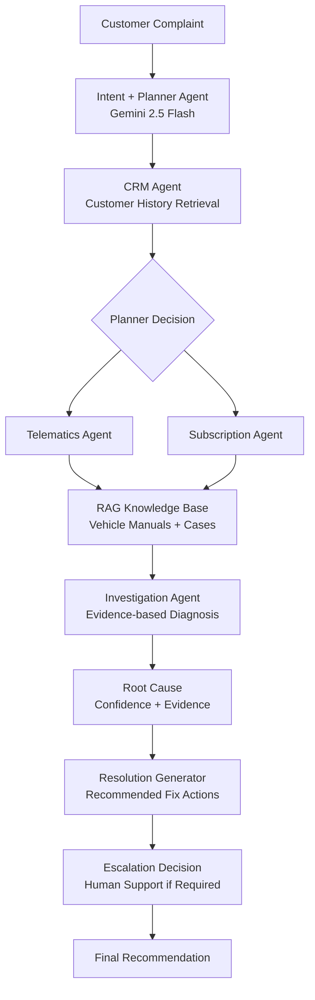

# Project Specification & Technical Report: Connected Car AI Support Console

**Author**: Senior Streamlit UI & AI Orchestration Engineer  
**Target Audience**: Academic / Project Evaluation Guide  
**Purpose**: Pre-Project Validation & System Architecture Check  
**Platform**: LangGraph Multi-Agent Stateful Orchestrator  
**LLM Model Core**: Google Gemini LLM Engine  

---

## Table of Contents
1. [Project Background & Motivation](#1-project-background--motivation)
2. [Workflow Architecture Specification](#2-workflow-architecture-specification)
   - [2.1 Textual Workflow Diagram](#21-textual-workflow-diagram)
   - [2.2 Interactive Mermaid.js Workflow DAG](#22-interactive-mermaidjs-workflow-dag)
3. [Shared State Definition (`AgentState`)](#3-shared-state-definition-agentstate)
4. [Node-by-Node Orchestration Flow](#4-node-by-node-orchestration-flow)
5. [Databases & Data Layer Schema](#5-databases--data-layer-schema)
   - [5.1 CRM Profile Registry](#51-crm-profile-registry)
   - [5.2 Subscription billing Entitlements](#52-subscription-billing-entitlements)
   - [5.3 Telematics ECU Registers](#53-telematics-ecu-registers)
   - [5.4 RAG Knowledge manual Repository](#54-rag-knowledge-manual-repository)
6. [Safety Gateways & Governance Guardrails](#6-safety-gateways--governance-guardrails)
7. [Technology Stack & Execution Blueprint](#7-technology-stack--execution-blueprint)

---

## 1. Project Background & Motivation

In the modern automotive sector, connected car platforms (e.g., Tesla App, MyHyundai, MyBMW, FordPass) continuously sync telemetry and service databases with vehicle hardware. When a remote command fails (e.g., door locks fail to actuate, remote-start is blocked, mobile app sync fails, or navigation network drops), customer support engineers must navigate multiple disjointed database layers to isolate the error:
1. **Billing Subscriptions**: Verify if remote packages are active or expired.
2. **eSIM Telematics**: Check cellular RSSI signal power and vehicle node ping status.
3. **Customer CRM**: Evaluate historical tickets and VIN records.
4. **Knowledge Base (RAG)**: Search mechanical manuals and symptoms bulletins.

Manual investigation across these registries increases case resolution times. This project implements the **Connected Car AI Support Console**, a stateful multi-agent orchestrator driven by **LangGraph** and **Google Gemini** that classifies queries, queries databases selectively based on dynamic planner switches, fetches RAG guides, and compiles root causes and resolutions in real-time.

---

## 2. Workflow Architecture Specification

### 2.1 Textual Workflow Diagram

<div id="architecture-diagram">

```text
┌─────────────────────────────┐
│     Customer Complaint      │
└──────────────┬──────────────┘
               │
               ▼
┌─────────────────────────────┐
│  Intent + Planner Agent     │
│  (Gemini 2.5 Flash)         │
└──────────────┬──────────────┘
               │
               ▼
┌─────────────────────────────┐
│         CRM Agent           │
│ Customer History Retrieval  │
└──────────────┬──────────────┘
               │
               ▼
       Planner Decision
      ┌───────┴────────┐
      │                │
      ▼                ▼
┌──────────────┐ ┌──────────────┐
│ Telematics   │ │ Subscription │
│    Agent     │ │    Agent     │
└──────┬───────┘ └──────┬───────┘
       │                │
       └──────┬─────────┘
              ▼
┌─────────────────────────────┐
│      RAG Knowledge Base     │
│  Vehicle Manuals + Cases    │
└──────────────┬──────────────┘
               │
               ▼
┌─────────────────────────────┐
│    Investigation Agent      │
│ Evidence-based Diagnosis    │
└──────────────┬──────────────┘
               │
               ▼
┌─────────────────────────────┐
│       Root Cause            │
│   Confidence + Evidence     │
└──────────────┬──────────────┘
               │
               ▼
┌─────────────────────────────┐
│    Resolution Generator     │
│  Recommended Fix Actions    │
└──────────────┬──────────────┘
               │
               ▼
┌─────────────────────────────┐
│    Escalation Decision      │
│ Human Support if Required   │
└──────────────┬──────────────┘
               │
               ▼
┌─────────────────────────────┐
│     Final Recommendation    │
└─────────────────────────────┘
```
</div>

---

### 2.2 Interactive Mermaid.js Workflow DAG
*(This diagram renders as a clean visual flowchart in modern markdown previewers or GitHub).*



---

## 3. Shared State Definition (`AgentState`)

The orchestrator utilizes a stateful dict container declared in `graph/state.py` to synchronize state variables across agents:

```python
from typing_extensions import TypedDict

class AgentState(TypedDict):
    customer_query: str          # Raw customer complaint description text
    planner_decision: dict       # Planner switches set by Intent Agent: {"crm": bool, "telematics": bool, "subscription": bool}
    issue_category: str          # Mapped domain category (e.g. app_pairing, vehicle_start_issue)
    severity: str                # Threat level (low, medium, high, critical)
    confidence: float            # LLM confidence on classification
    customer_id: str             # Customer account ID
    vehicle_id: str              # Vehicle VIN identifier
    crm_data: dict               # Customer details pulled from CRM
    telematics_data: dict        # ECU signal and battery sensor registers
    subscription_status: str     # Billing package state (active/expired)
    kb_context: str              # Text manual content extracted by RAG
    root_cause: str              # Isolated failure origin
    resolution: str              # Actionable remediation steps
    root_cause_confidence: float # Compiler confidence score
    evidence_used: list          # Checklist parameters proving the root cause
    investigation_steps: list    # Live workflow execution logs
```

---

## 4. Node-by-Node Orchestration Flow

Each node in the LangGraph DAG operates as a dedicated agent or tool executor:

### Node 1: Intent & Planner Node (`intent_agent.py`)
* **Objective**: Evaluate the customer query and plan the path.
* **Orchestrator Rules**:
  * `app_pairing` / `remote_control_issue` -> Query CRM, Telematics, and Subscriptions.
  * `door_lock_issue` -> Query CRM only.
  * `vehicle_start_issue` / `charging_issue` / `connectivity_issue` -> Query CRM and Telematics.
  * `subscription_issue` -> Query CRM and Subscriptions.

### Node 2: CRM Profile Node (`crm_agent.py`)
* **Objective**: Query customer schemas from `crm.json`. Returns ticket counters and VIN mappings.

### Node 3: Telematics ECU Node (`telematics_agent.py`)
* **Objective**: If `planner_decision["telematics"]` is `True`, ping the mock vehicle transceivers (`telematics.json`). Returns battery SoC percentage, network status, and signal RSSI logs.

### Node 4: Subscription Validator Node (`subscription_agent.py`)
* **Objective**: If `planner_decision["subscription"]` is `True`, query billing registers (`subscriptions.json`) to confirm service entitlement states.

### Node 5: Knowledge Base RAG Node (`knowledge_agent.py`)
* **Objective**: Retrieve matching manual troubleshooting guidelines from local files (`data/kb/*.txt`) matching the classified category.

### Node 6: Investigation Node (`investigation_agent.py`)
* **Objective**: Consolidate database registers, RAG documentation, and original complaint inputs. Isolates the single most likely root cause and compiles step-by-step resolution steps.

---

## 5. Databases & Data Layer Schema

### 5.1 CRM Profile Registry (`data/crm.json`)
```json
{
  "C001": {
    "name": "Hemanth N",
    "vehicle_id": "V001",
    "previous_tickets": 3
  }
}
```

### 5.2 Subscription billing Entitlements (`data/subscriptions.json`)
```json
{
  "C001": {
    "status": "expired"
  },
  "C002": {
    "status": "active"
  }
}
```

### 5.3 Telematics ECU Registers (`data/telematics.json`)
```json
{
  "V001": {
    "online": true,
    "battery": 78,
    "network": "good"
  }
}
```

### 5.4 RAG Knowledge manual Repository (`data/kb/`)
Technical guidelines are structured in text modules:
* `app_pairing.txt`
* `door_lock_issue.txt`
* `subscription_issue.txt`
* `vehicle_start_issue.txt` (and others)

*Representative Example (`data/kb/door_lock_issue.txt`):*
```text
Issue Category: Door Lock Issue
Common Symptoms:
- Door not unlocking
- Key fob unlock not working
Possible Causes:
1. Key fob battery dead
2. Actuator failure
Recommended Actions:
- Check vehicle battery State of Charge
- Inspect key fob battery
- Replace actuator hardware
```

---

## 6. Safety Gateways & Governance Guardrails

To prevent incorrect automated dispatches, the orchestrator executes automated safety checks:
1. **Low Confidence Check**: If the compiler confidence score falls below **70%** (`root_cause_confidence < 0.70`), the system blocks OTA dispatches and flags the ticket for manual **Tier-3 Engineering support**.
2. **Unknown Scope Route**: If the Intent Classifier fails to resolve the category and maps it to `unknown`, the orchestrator immediately triggers human technician escalations.

---

## 7. Technology Stack & Execution Blueprint

### 7.1 Tech Stack
* **State Orchestrator**: LangGraph StateGraph (DAG architecture)
* **LLM Engine Driver**: LangChain Core / ChatGoogleGenerativeAI
* **Structured Models**: Google Gemini (temperature = 0 for deterministic outputs)
* **Frontend GUI Console**: Streamlit Dark Theme Dashboard UI
* **Development Environment**: Python 3.12, Python-Dotenv, Pydantic v2

### 7.2 Execution Instructions
```powershell
# 1. Activate Virtual Environment
.\venv\Scripts\Activate.ps1

# 2. Launch Streamlit Diagnostics Dashboard
streamlit run app.py

# 3. Launch CLI Test Suite Runner
python main.py
```
---
*End of Specification Document.*
